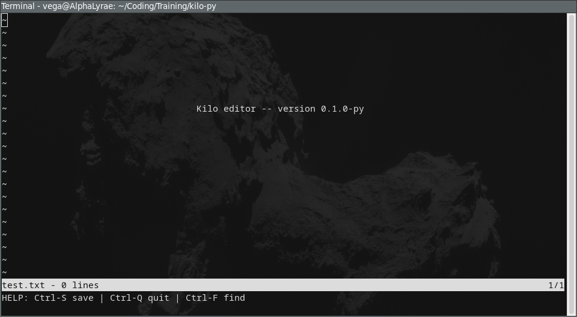

# kilo-py

Minimal terminal text editor inspired by Kilo, written in Python.



## Intent
- Python-first and maintainable over strict 1:1 C parity.
- Keep the editor small, usable, and easy to reason about.
- Preserve core workflow (`open`, `edit`, `save`, `find`, `quit`) without chasing every low-level C edge case.

## Run
```bash
python3 src/main.py <filename>
```

## Keys
- `Ctrl-S`: save
- `Ctrl-Q`: quit (asks for confirmation when there are unsaved changes)
- `Ctrl-F`: find
- Arrows / Page Up / Page Down / Home / End: navigation
- Enter / Backspace / Del / Tab: editing
